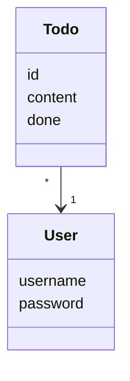





Tämän viikon tehtävien palautuksesta on tarjolla 1 piste ja harjoitustyön palautuksesta 2 pistettä.

Tee palautettavia tehtäviä varten repositorion sisällä olevaan hakemistoon _laskarit_ uusi alihakemisto _viikko3_.

## UML

Ohjelmistojen dokumentoinnissa ja sovelluksen suunnittelun yhteydessä on usein tapana visualisoida ohjelman rakennetta ja toimintaa [UML](https://en.wikipedia.org/wiki/Unified_Modeling_Language)-kaavioilla.

UML tarjoaa lukuisia erilaisia kaaviotyyppejä, hyödynnämme kurssilla kuitenkin näistä ainoastaan kolmea.

### Luokkakaaviot

Kurssilla [Tietokantojen perusteet](https://tikape-k20.mooc.fi) olet saattanut jo tutustua luokkakaavioiden käyttöön. Luokkakaavioiden käyttötarkoitus on ohjelman luokkien ja niiden välisten suhteiden kuvailu. Todo-sovelluksen oleellista tietosisältöä edustavat käyttäjää vastaava luokka `User`:

```python
class User:
    def __init__(self, username, password):
        self.username = username
        self.password = password
```

ja tehtävää vastaava luokka `Todo`:

```python
import uuid

class Todo:
    def __init__(self, content, done=False, user=None, todo_id=None):
        self.content = content
        self.done = done
        self.user = user
        self.id = todo_id or str(uuid.uuid4())

    def set_done(self):
        self.done = True
```

Jokaiseen todoon liittyy yksi käyttäjä, ja yksittäiseen käyttäjään liittyviä todoja voi olla useita. Tilannetta kuvaa seuraava luokkakaavio


Luokkakaavioon on nyt merkitty molempien luokkien oliomuuttujat sekä metodit. Yleensä ei ole mielekästä kuvata luokkia tällä tarkkuudella, eli luokkakaavioihin riittää merkitä luokan nimi:


Luokkien tarkemmat yksityiskohdat selviävät koodia katsomalla tai docstring-dokumentoinnista, johon tutustutaan viikolla 6.

#### Riippuvuus

UML-kaavioissa olevat "viivat" kuvaavat luokkien olioiden välistä _pysyvää yhteyttä_. Joissain tilanteissa on mielekästä merkata kaavioihin myös ei-pysyvää suhdetta kuvaava katkoviiva, eli _riippuvuus_.

Eräs tällainen tilanne voisi olla Unicafe-ruokalan kassapäätteen toiminnallisuudesta vastaava koodi. Koodissa on kaksi luokkaa `Maksukortti` ja `Kassapaate`, joiden välillä ei ole pysyvää yhteyttä.

Maksukortin koodi on seuraava:

```python
class Maksukortti:
  def __init__(self, saldo):
      self.saldo = saldo

  def lataa_rahaa(self, lisays):
      self.saldo += lisays

  def ota_rahaa(self, maara):
      if self.saldo < maara:
          return False

      self.saldo -= maara

      return True
```

Kuten huomataan, koodissa ei mainita kassapäätettä millään tavalla.

Kassapäätteen hieman lyhennetty koodi on seuraava:

```python
EDULLISEN_HINTA = 2.5
MAUKKAAN_HINTA = 4.3

class Kassapaate:
    def __init__():
        self.edulliset = 0
        self.maukkaat = 0

    def syo_edullisesti(self, kortti):
        if kortti.saldo() < EDULLISEN_HINTA:
            return False

        kortti.ota_rahaa(EDULLISEN_HINTA);
        self.edulliset += 1
        return True

    def syo_maukkaasti(self, kortti):
        # ...

    def lataa_rahaa_korttille(self, kortti, summa):
        if summa < 0:
            return

        kortti.lataa_rahaa(summa)
        self.rahaa += summa
```

Kassapääte käyttää maksukortteja hetkellisesti lounaiden maksamisen ja rahan lataamisen yhteydessä. Kassapääte ei kuitenkaan muista pysyvästi yksittäisiä maksukortteja. Tämän takia kassapäätteellä on riippuvuus maksukortteihin, mutta ei kuitenkaan normaalia yhteyttä, sillä UML-kaavioon merkattu yhteys viittaa pysyvään, ajallisesti pidempikestoiseen suhteeseen.

Tilannetta kuvaava luokkakaavio on seuraava:


Riippuvuus siis kuvataan _katkoviivallisena nuolena_, joka kohdistuu siihen luokkaan mistä ollaan riippuvaisia. Riippuvuuteen ei merkitä numeroa toisin kuin yhteyteen.

Tarkastellaan toisena esimerkkinä riippuvuudesta todo-sovelluksen sovelluslogiikasta vastaavaa luokkaa `TodoService`, jonka koodi hieman lyhennettynä näyttää seuraavalta:

```python
class TodoService:
    def __init__(self, todo_repository, user_repository):
        self._user = None
        self._todo_repository = todo_repository
        self._user_repository = user_repository

    def create_todo(self, content):
        todo = Todo(content=content, user=self._user)

        return self._todo_repository.create(todo)

    def get_undone_todos(self):
        if not self._user:
            return []

        todos = self._todo_repository.find_by_username(self._user.username)
        undone_todos = filter(lambda todo: not todo.done, todos)

        return list(undone_todos)

    # ...
```

Sovelluslogiikkaa hoitava olio tuntee kirjautuneen käyttäjän, mutta pääsee käsiksi kirjautuneen käyttäjän todoihin ainoastaan `todo_repository`-olion välityksellä. Tämän takia luokalla ei ole yhteyttä luokkaan `Todo`, luokkien välillä on kuitenkin _riippuvuus_, sillä sovelluslogiikka käsittelee metodeissaan todo-olioita.

Merkitään luokkakaavioon seuraavasti:


Riippuvuuksien merkitseminen luokkakaavioihin ei ole välttämättä kovin oleellinen asia, niitä kannattaa merkitä jos ne tuovat esille tilanteen kannalta jotain oleellista.

#### Perintä

Luokkien [perintähierarkian](https://docs.python.org/3/tutorial/classes.html#inheritance) ilmaisemisessa käytetään nuolia, joissa on valkoiset päät. Esim. jos Todo-sovelluksessa olisi normaalin käyttäjän eli luokan `User` perivää ylläpitäjää kuvaava luokka `SuperUser`, merkattaisiin se luokkakaavioon seuraavasti:


#### Työkaluja luokkakaavioiden piirtämiseen

GitHubin markdown-tiedostoissa erilaisia kaavioita voi toteuttaa kätevästi [Mermaid](https://mermaid-js.github.io/mermaid/)-syntaksin avulla. Kaavioista ei tarvitse erillisiä kuvatiedostoja, vaan ne voi määritellä suoraan markdown-tiedostoon:

````markdown
## Sovelluslogiikka

Sovelluksen loogisen tietomallin muodostavat luokat User ja Todo, jotka kuvaavat käyttäjiä ja käyttäjien tehtäviä:


````

Dokumentaation [Luokkakaavio](https://mermaid-js.github.io/mermaid/#/classDiagram)-osiosta löytyy tarkemmat ohjeet luokkakaavioiden toteuttamiseen. Mallia kaavioiden käyttämisessä markdown-tiedostossa voi ottaa referenssisovelluksen [arkkitehtuuri](https://raw.githubusercontent.com/ohjelmistotekniikka-hy/python-todo-app/master/dokumentaatio/arkkitehtuuri.md)-dokumentaatiosta. Vaihtoehtoisesti, luokkakaavioiden toteuttamiseen sopii myös esimerkiksi <https://app.diagrams.net/>.

### Tehtävä 1: Monopoli

[Monopoli](http://fi.wikipedia.org/wiki/Monopoli_(peli)) on varmasti kaikkien tuntema lautapeli.

Tehdään luokkakaavio, joka kuvaa pelissä olevia asioita ja niiden suhteita.

Tässä tehtävän osassa tehdään alustava luokkakaavio, joka ei kuvaa peliä vielä kokonaisuudessaan vaan sisältää vasta seuraavat elementit:

Monopolia pelataan käyttäen kahta noppaa. Pelaajia on vähintään 2 ja enintään 8. Peliä pelataan pelilaudalla joita on yksi. Pelilauta sisältää 40 ruutua. Kukin ruutu tietää, mikä on sitä seuraava ruutu pelilaudalla. Kullakin pelaajalla on yksi pelinappula. Pelinappula sijaitsee aina yhdessä ruudussa.

**Lisää tämän viikon tehtäviä varten repositoriosi _laskarit_ hakemistoon hakemisto _viikko3_ ja lisää toteuttamasi kaavio sinne.** Jos hyödynnät Mermaid-syntaksia kaavion toteuttamisessa, voit sijoittaa kaavion markdown-tiedostoon.

### Tehtävä 2: Laajennettu Monopoli

Laajennetaan edellisen tehtävän luokkakaaviota tuomalla esiin seuraavat asiat:

Ruutuja on useampaa eri tyyppiä:

- Aloitusruutu
- Vankila
- Sattuma ja yhteismaa
- Asemat ja laitokset
- Normaalit kadut (joihin liittyy nimi)

Monopolipelin täytyy tuntea sekä aloitusruudun että vankilan sijainti.

Jokaiseen ruutuun liittyy jokin toiminto.

Sattuma- ja yhteismaaruutuihin liittyy kortteja, joihin kuhunkin liittyy joku toiminto.

Toimintoja on useanlaisia. Ei ole vielä tarvetta tarkentaa toiminnon laatua.

Normaaleille kaduille voi rakentaa korkeintaan 4 taloa tai yhden hotellin. Kadun voi omistaa joku pelaajista. Pelaajilla on rahaa.

**Lisää toteuttamasi kaavio repositoriosi _laskarit/viikko3_-hakemistoon.**

### Pakkauskaavio

Todo-sovelluksen koodi on sijoitettu hakemistoihin seuraavasti:


Hakemistorakennetta voidaan kuvata UML:ssä _pakkauskaaviolla_:


Pakkausten välille on merkitty _riippuvuudet_ katkoviivalla. Pakkaus _ui_ riippuu pakkauksesta _services_ sillä _ui_-pakkauksen luokat käyttävät _services_-pakkauksen luokkaa `TodoService`, joka vastaa sovelluksen sovelluslogiikasta.

Vastaavasti pakkaus _services_ riippuu pakkauksesta _repositories_ sillä sen luokka `TodoService` käyttää _repositorios_-pakkauksen luokkia `TodoRepository` ja `UserRepository`.

Pakkauskaavioihin on myös mahdollista merkitä pakkausten sisältönä olevia luokkia normaalin luokkakaaviosyntaksin mukaan:


Sovelluksen koodi on organisoitu _kerrosarkkitehtuurin_ periaatteiden mukaan. Asiasta lisää hieman [täällä](/python/toteutus). Myös Ohjelmoinnin jatkokurssin osa 10 luku [Laajemman sovelluksen kehittäminen](https://ohjelmointi-22.mooc.fi/osa-10/4-lisaa-esimerkkeja) voi olla hyödyllinen. 

### Sekvenssikaaviot

Luokka- ja pakkauskaaviot kuvaavat ohjelman rakennetta. Ohjelman toiminta ei kuitenkaan tule niistä ilmi millään tavalla.

Esimerkiksi Unicafe-ruokalan maksukortin ja kassapäätteen välistä suhdetta kuvaava luokkakaavio voisi näyttää seuraavalta:


Vaikka kaavioon on merkitty metodien nimet, ei ohjelman toimintalogiikka, esimerkiksi mitä tapahtuu kun kortilla ostetaan edullinen lounas, selviä kaaviosta millään tavalla.

_Sekvenssikaaviot_ on alunperin kehitetty kuvaamaan verkossa olevien ohjelmien keskinäisen kommunikoinnin etenemistä. Sekvenssikaaviot sopivat kohtuullisen hyvin kuvaamaan myös sitä, miten ohjelman oliot kutsuvat toistensa metodeja suorituksen aikana.

Koodia katsomalla näemme, että lounaan maksaminen tapahtuu siten, että ensin kassapääte kysyy kortin saldoa ja jos se on riittävä, vähentää kassapääte lounaan hinnan kortilta ja palauttaa _True_:

```python
EDULLISEN_HINTA = 2.5

class Kassapaate:
    # ...

    def syo_edullisesti(self, kortti):
        if kortti.saldo < EDULLISEN_HINTA:
            return False

        kortti.ota_rahaa(EDULLISEN_HINTA)
        self.edulliset += 1
        return True

    # ...
```

Sekvenssikaaviona kuvattuna tilanne näyttää seuraavalta:


Sekvenssikaaviossa oliot kuvataan laatikoina, joista lähtee alaspäin olion "elämänlanka". Kaaviossa aika etenee ylhäältä alas. Metodikutsut kuvataan nuolena, joka yhdistää kutsujan ja kutsutun olion elämänlangat. Paluuarvo merkitään katkoviivalla. Attribuutin arvon lukeminen tai asettaminen voidaan kuvata kaaviossa metodikutsun tavoin. Tästä esimerkkinä kaavion `saldo`-attribuutin lukeminen.

Jos saldo ei riitä, etenee suoritus seuraavan sekvenssikaavion tapaan:


Tarkastellaan hieman monimutkaisempaa tapausta, yrityksen palkanhallinnasta vastaavaa ohjelmaa:

```python
class Henkilo:
    def __init__(self, nimi, palkka, tilinumero):
        self.nimi = nimi
        self.palkka = palkka
        self.tilinumero = tilinumero

class Henkilostorekisteri:
    def __init__(self):
        self._henkilot = {}
        self._pankki = PankkiRajapinta()

    def lisaa(self, henkilo):
        self._henkilot[henkilo.nimi] = henkilo

    def suorita_palkanmaksu(self):
        for nimi in self._henkilot:
            henkilo = self._henkilot[nimi]
            self._pankki.maksa_palkka(henkilo.tilinumero, henkilo.palkka)

    def aseta_palkka(self, nimi, uusi_palkka):
        henkilo = self._henkilot[nimi]
        henkilo.palkka = uusi_palkka

class PankkiRajapinta:
    # ...

    def maksa_palkka(tilinumero, summa):
        # suorittaa maksun verkkopankin internet-rajapinnan avulla
        # yksityiskohdat piilotettu
```

Sekvenssikaaviot siis kuvaavat yksittäisten suoritusskenaarioiden aikana tapahtuvia asioita. Kuvataan nyt seuraavan pääohjelman aikaansaamat tapahtumat:

```python
def main():
    rekisteri = Henkilostorekisteri()

    arto = Henkilo("Hellas", 1200, "1234-12345")
    rekisteri.lisaa(arto)

    sasu = Henkilo("Tarkoma", 6500, "4455-123123")
    rekisteri.lisaa(sasu)

    rekisteri.aseta_palkka("Hellas", 3500)

    rekisteri.suorita_palkanmaksu()
```

Sekvenssikaavio on seuraavassa:


Kaavio alkaa tilanteesta, jossa `Henkilostorekisteri`-luokan olio on jo luotu, mutta henkilöolioita ei vielä ole olemassa.

Toiminta alkaa siitä, kun pääohjelma eli main luo henkilön nimeltä `arto`. Seuraavaksi `main`-funktiosta kutsutaan rekisterin metodia `lisaa`, jolle annetaan argumentiksi luotu henkilöolio. Vastaava toistuu kun `main` luo uuden henkilön ja lisää sen rekisteriin.

Seuraavana toimenpiteenä main kasvattaa arton palkkaa kutsumalla rekisterin metodia `aseta_palkka`. Tämä saa aikaan sen, että `rekisteri` asettaa `arto`-olion `palkka`-attribuutille uuden arvon. Rekisterin viivaan on merkitty paksunnus, joka korostaa, että attribuutille on asetettu arvo. Huomaa, että olion attribuutin asettamista voidaan kuvata metodikutsun tavoin.

Viimeinen ja monimutkaisin toiminnoista käynnistyy, kun `main` kutsuu rekisterin metodia `suorita_palkanmaksu`. Rekisteri kysyy ensin arton tilinumeroa ja palkkaa ja kutsuu paluuarvoina olevilla tiedoilla pankin metodia `maksa_palkka` ja sama toistuu `sasu`-olion kohdalla.

Sekvenssikaaviot eivät ole optimaalinen tapa ohjelman suorituslogiikan kuvaamiseen. Ne sopivat jossain määrin olio-ohjelmien toiminnan kuvaamiseen, mutta esim. funktionaalisella tyylillä tehtyjen ohjelmien kuvaamisessa ne ovat varsin heikkoja.

Tietynlaisten tilanteiden kuvaamiseen ohjelmoinnin perusteissakin käsitellyt [vuokaaviot](https://materiaalit.github.io/ohjelmointi-18/part2/) voivat sopia paremmin.

Voit halutessasi lukea lisää sekvenssikaavioista kurssin vanhan version [materiaalista](https://github.com/mluukkai/OTM2016/blob/master/luennot/luento5.pdf).

#### Työkaluja sekvenssikaavioiden piirtämiseen

Myös sekvenssikaavioiden toteuttaminen onnistuu kätevästi [Mermaid](https://mermaid-js.github.io/mermaid/)-syntaksin avulla. Dokumentaation [Sekvenssikaavio](https://mermaid-js.github.io/mermaid/#/sequenceDiagram)-osiosta löytyy tarkemmat ohjeet sekvenssikaavioiden toteuttamiseen. Mallia kaavioiden käyttämisessä markdown-tiedostossa voi ottaa referenssisovelluksen [arkkitehtuuri](https://raw.githubusercontent.com/ohjelmistotekniikka-hy/python-todo-app/master/dokumentaatio/arkkitehtuuri.md)-dokumentaatiosta. Vaihtoehtoisesti, sekvenssikaavioiden toteuttamiseen sopii myös esimerkiksi <https://www.websequencediagrams.com/>.

### Tehtävä 3: Sekvenssikaavio

Tarkastellaan bensatankista ja moottorista koostuvan koneen Python-koodia.

Piirrä sekvenssikaaviona tilanne, jossa kutsutaan (jostain koodin ulkopuolella olevasta metodista) ensin `Machine`-luokan konstruktoria ja sen jälkeen luodun Machine-olion metodia `drive`.

Muista, että sekvenssikaaviossa tulee tulla ilmi kaikki mainin suorituksen aikaansaamat olioiden luomiset ja metodien kutsut!

```python
class Machine:
    def __init__(self):
        self._tank = FuelTank()
        self._tank.fill(40)
        self._engine = Engine(self._tank)

    def drive(self):
        self._engine.start()
        running = self._engine.is_running()

        if running:
          self._engine.use_energy()

class FuelTank:
    def __init__(self):
        self.fuel_contents = 0

    def fill(self, amount):
        self.fuel_contents = amount

    def consume(self, amount):
        self.fuel_contents = self.fuel_contents - amount

class Engine:
    def __init__(self, tank):
        self._fuel_tank = tank

    def start(self):
        self._fuel_tank.consume(5)

    def is_running(self):
        return self._fuel_tank.fuel_contents > 0

    def use_energy(self):
        self._fuel_tank.consume(10)
```

**Lisää toteuttamasi kaavio repositoriosi _laskarit/viikko3_-hakemistoon.** Jos hyödynnät Mermaid-syntaksia kaavion toteuttamisessa, voit sijoittaa kaavion markdown-tiedostoon.

### Tehtävä 4: Laajempi sekvenssikaavio

Tarkastellaan HSL-matkakorttien hallintaan käytettävää koodia.

Kuvaa _sekvenssikaaviona_ koodin `main`-funktion suorituksen aikaansaama toiminnallisuus.

Muista, että sekvenssikaaviossa tulee tulla ilmi kaikki mainin suorituksen aikaansaamat olioiden luomiset ja metodien kutsut!

```python
class Kioski:
    def osta_matkakortti(self, nimi, arvo = None):
        uusi_kortti = Matkakortti(nimi)

        if arvo:
            uusi_kortti.kasvata_arvoa(arvo)

        return uusi_kortti

class Matkakortti:
    def __init__(self, omistaja):
        self.omistaja = omistaja
        self.pvm = 0
        self.kk = 0
        self.arvo = 0

    def kasvata_arvoa(self, maara):
        self.arvo += maara

    def vahenna_arvoa(self, maara):
        self.arvo -= maara

    def uusi_aika(self, pvm, kk):
        self.pvm = pvm
        self.kk = kk

class Lataajalaite:
    def lataa_arvoa(self, kortti, maara):
        kortti.kasvata_arvoa(maara)

    def lataa_aikaa(self, kortti, pvm, kk):
        kortti.uusi_aika(pvm, kk)

RATIKKA = 1.5
HKL = 2.1
SEUTU = 3.5

class Lukijalaite:
    def osta_lippu(self, kortti, tyyppi):
        hinta = 0

        if tyyppi == 0:
            hinta = RATIKKA
        elif tyyppi == 1:
            hinta = HKL
        else:
            hinta = SEUTU

        if kortti.arvo < hinta:
            return False

        kortti.vahenna_arvoa(hinta)

        return True

class HKLLaitehallinto:
    def __init__(self):
        self._lataajat = []
        self._lukijat = []

    def lisaa_lataaja(self, lataaja):
        self._lataajat.append(lataaja)

    def lisaa_lukija(self, lukija):
        self._lukijat.append(lukija)

def main():
    laitehallinto = HKLLaitehallinto()

    rautatietori = Lataajalaite()
    ratikka6 = Lukijalaite()
    bussi244 = Lukijalaite()

    laitehallinto.lisaa_lataaja(rautatietori)
    laitehallinto.lisaa_lukija(ratikka6)
    laitehallinto.lisaa_lukija(bussi244)

    lippu_luukku = Kioski()
    kallen_kortti = lippu_luukku.osta_matkakortti("Kalle")

    rautatietori.lataa_arvoa(kallen_kortti, 3)

    ratikka6.osta_lippu(kallen_kortti, 0)
    bussi244.osta_lippu(kallen_kortti, 2)

if __name__ == "__main__":
    main()
```

**Lisää toteuttamasi kaavio repositoriosi _laskarit/viikko3_-hakemistoon.** Jos hyödynnät Mermaid-syntaksia kaavion toteuttamisessa, voit sijoittaa kaavion markdown-tiedostoon.

## Tehtävien suorittaminen ja Invoke

Projekteissa on useimmiten monia toistuvasti suoritettavia _tehtäviä_, joita suoritetaan terminaalissa annettavien komentojen muodossa. Luultavasti tärkein näistä tehtävistä on sovelluksen käynnistäminen, joka saattaa tapahtua esimerkiksi komennolla `python3 src/index.py`.

Tehtäviin liittyvien komentojen kirjoittaminen käsin käy helposti työlääksi. Tämä tulee ilmi etenkin tilanteissa, joissa komennot ovat monimutkaisia, tai vaativat useampien komentojen suorittamista. Ongelman ratkaisemiseksi on kehitetty työkaluja, joiden avulla tehtäviä voi määritellä ja suorittaa terminaalissa helposti. Tutustutaan seuraavaksi erääseen tähän käyttötarkoitukseen soveltuvaan työkaluun nimeltä [Invoke](http://docs.pyinvoke.org/en/stable/).

### Asennus

Invoken asennus projektiin onnistuu komennolla:

```bash
poetry add invoke
```

### Tehtävien määritteleminen

Invoken avulla määritellyt tehtävät toteutetaan projektin juurihakemiston _tasks.py_-tiedostoon. Tehtävät ovat funktioita, joissa käytetään `@task`-[dekoraattoria](https://wiki.python.org/moin/PythonDecorators). Toteutetaan esimerkkinä _tasks.py_-tiedostoon tehtävä nimeltä _foo_, joka tulostaa tekstin "bar":

```python
from invoke import task

@task
def foo(ctx):
    print("bar")
```

Tämän erittäin hyödyllisen tehtävän voi suorittaa terminaalissa komennolla:

```bash
poetry run invoke foo
```

Komennon suorittamisen pitäisi tulostaa komentoriville teksti "bar". Tehtävät voi siis suorittaa terminaalissa komennolla, joka on muotoa `poetry run invoke <tehtävä>`. Huomaa, että `poetry run`-komennon ansiosta tehtävät suoritetaan virtuaaliympäristössä.

Toteutetaan seuraavaksi _foo_-tehtävän lisäksi tehtävä, josta on oikeasti hyötyä. Tarvitsemme tehtävän, joka suorittaa sovelluksemme komennolla `python3 src/index.py`. Annetaan tälle tehtävälle nimeksi _start_:

```python
from invoke import task

@task
def foo(ctx):
    print("bar")

@task
def start(ctx):
    ctx.run("python3 src/index.py", pty=True)
```

Voimme suorittaa tehtävässä komentorivikomennon käyttämällä parametrina saadun [Context](http://docs.pyinvoke.org/en/stable/api/context.html#module-invoke.context)-olion metodia [run](http://docs.pyinvoke.org/en/stable/api/context.html#invoke.context.Context.run). Tehtävän suorittaminen onnistuu komennolla `poetry run invoke start`. Huomaa, että `pty=True`-argumentti on erityisen tärkeä komentorivikäyttöliittymässä, jotta sovelluksen syötteet ja tulosteet toimivat [odotetulla tavalla](https://www.pyinvoke.org/faq.html#why-is-my-command-behaving-differently-under-invoke-versus-being-run-by-hand).

Voimme listata kaikki projektissa käytössä olevat tehtävät komennolla:

```bash
poetry run invoke --list
```

### Huomioita tehtävien nimeämisestä

Jos tehtävän määrittelevän funktion nimi on [snake_case](https://en.wikipedia.org/wiki/Snake_case)-formaatissa, on komentoriviltä suoritettavan tehtävän nimi [kebab-case](https://en.wikipedia.org/wiki/Letter_case#Kebab_case)-formaatissa. Esimerkiksi seuraavasti nimetty tehtävä:

```python
from invoke import task

@task
def lorem_ipsum(ctx):
    print("Lorem ipsum")
```

Suoritettaisiin komennolla `poetry run invoke lorem-ipsum`. Jos olet epävarma käytössä olevien tehtävien nimistä, voit aina listata ne komennolla `poetry run invoke --list`.

### Toisistaan riippuvaiset tehtävät

[Coverage-ohjeissa](/python/viikko2#coverage-ja-testikattavuus) tutustuimme testikattavuuden keräämiseen ja raportin muodostamiseen sen perusteella. Jos haluamme muodostaa testikattavuusraportin, tulee testikattavuus olla ensin kerätty. Käyttötarkoitukseen soveltuvilla tehtävillä voisi olla määrittelyt seuraavasti:

```python
from invoke import task

@task
def coverage(ctx):
    ctx.run("coverage run --branch -m pytest", pty=True)

@task()
def coverage_report(ctx):
    ctx.run("coverage html", pty=True)
```

Jos suoritamme tehtävän _coverage-report_ ennen _coverage_-tehtävän suorittamista, raportti sisältää joko vanhat testikattavuustiedot, tai kohtaamme virheen, joka valittaa testikattavuustietojen puutosta. Voisimme suorittaa komennot peräkkäin komennolla:

```bash
poetry run invoke coverage coverage-report
```

Helpompaa on kuitenkin määritellä _coverage-report_-tehtävä riippuvaiseksi _coverage_-tehtävästä. Tämä onnistuu antamalla `@task`-dekoraattorille argumentiksi _coverage_-tehtävän funktio:

```python
from invoke import task

@task
def coverage(ctx):
    ctx.run("coverage run --branch -m pytest", pty=True)

@task(coverage)
def coverage_report(ctx):
    ctx.run("coverage html", pty=True)
```

Nyt komento `poetry run invoke coverage-report` suorittaa ensin tehtävän _coverage_, jonka jälkeen suoritetaan itse tehtävä _coverage-report_.

## Harjoitustyö

Tämän viikon aikana aloitetaan harjoitustyön toteutus ja testaaminen. Ohjelman tulee edistyä jokaisella viikolla tasaisesti. Jos ohjelma tulee valmiiksi jo ennen loppupalautusta valmistaudu laajentamaan sitä saadaksesi ohjelman edistymisestä pisteet. Tarkoitus on edistää projektia tasaisesti kurssiviikkojen aikana.

**Tämän viikon harjoitustyön palautuksesta on tarjolla 2 pistettä.** Viikkopisteiden lisäksi kannattaa pitää mielessä harjoitustyön lopullisen palautuksen [arvosteluperusteet](/python/arvosteluperusteet).

### Harjoitustyö 1: Poetry projektin alustaminen

Alusta repositoriosi juureen Poetry-projekti edellisen viikon [Poetry-ohjeiden](/python/viikko2#poetry-ja-riippuvuuksien-hallinta) mukaisesti. Repositorion rakenne tulee olla seuraava:

```
laskarit/
  ...
dokumentaatio/
  ...
src/
  ...
pyproject.toml
poetry.lock
README.md
...
```

Projektin koodi tulee sijoittaa repositorion _src_-hakemistoon. Koodia kannattaa tarpeen mukaan jakaa hakemiston sisällä alihakemistoihin. Mallia voi ottaa [referenssisovelluksesta]({{site.python_reference_app_url}}).

Voit myös halutessasi alustaa projektin haluamaasi alihakemistoon, esimerkiksi seuraavasti:

```
laskarit/
  ...
todo-app/
  dokumentaatio/
    ...
  src/
    ...
  pyproject.toml
  poetry.lock
  ...
README.md
...
```

**HUOM:** _src_-hakemiston **alahakemistoissa** (ei siis itse _src_-hakemistossa) tulee olla tyhjät <i>\_\_init\_\_.py</i>-tiedostot, jotta mm. `import`-lauseet toimivat halutulla tavalla. Lisää aiheesta voi lukea Pythonin [dokumentaatiosta](https://docs.python.org/3/tutorial/modules.html) ja mallia voi ottaa [referenssisovelluksesta]({{site.python_reference_app_url}}).

### Harjoitustyö 2: Toiminnallisuuden toteutus

Toteuta ainakin osa jostain edellisellä viikolla tekemäsi määrittelydokumentin toiminnallisuudesta. Pelkät tyhjät luokat tai funktiot ilman toiminnallisuutta eivät tuo pisteitä.

Toteutukseen liittyviä ohjeita löydät [täältä](/python/toteutus). Jos olet toteuttamassa peliä, kannattaa yleisten ohjeiden lisäksi tutustua [pygame-ohjeeseen](/python/pygame).

### Harjoitustyö 3: Testaamisen aloittaminen

Sovelluksella on oltava _vähintään yksi testi_. Testin tulee olla mielekäs, eli sen on testattava jotain ohjelman kannalta merkityksellistä asiaa. Testin tulee myös mennä läpi. Lisää testejä varten _src_ hakemistoon hakemisto _tests_ ja lisää testitiedostot sinne:

```
src/
  tests/
    __init__.py
    ...
  ...
```

Kertaa edellisen viikon [unittest-ohjeet](/python/viikko2#unittest-ja-testaaminen), jos tämä tuottaa hankaluuksia.

### Harjoitustyö 4: Testikattavuusraportti

Ohjelmalle tulee pystyä generoimaan coverage-työkalun avulla testikattavuusraportti. Projektin juurihakemistossa (samassa hakemistossa, missä _pyproject.toml_-tiedosto sijaitsee) tulee olla _.coveragerc_-tiedosto, jossa määritellään, mistä hakemistosta testikattavuus kerätään. Testeihin liittyvä koodi tulee jättää testikattavuusraportin ulkopuolelle:

```
[run]
source = src
omit = src/**/__init__.py,src/tests/**
```

Kertaa edellisen viikon [coverage-ohjeet](/python/viikko2#coverage-ja-testikattavuus), jos tämä tuottaa hankaluuksia. Mallia coveragen konfigurointiin voi tarvittaessa ottaa [referenssisovelluksesta]({{site.python_reference_app_url}}).

### Harjoitustyö 5: Invoke-tehtävät

Toteuta projektille seuraavat Invoke-tehtävät:

- `poetry run invoke start` käynnistää ohjelman
- `poetry run invoke test` suorittaa testit pytestin avulla
- `poetry run invoke coverage-report` kerää coveragen avulla testikattavuuden ja muodostaa sen perusteella selaimessa avattavan, HTML-muotoisen testikattavuusraportin

Mallia Invoke-tehtävien toteutukseen voi ottaa tarvittaessa [referenssisovelluksesta]({{site.python_reference_app_url}}). Voit halutessasi lisätä myös muita tehtäviä, joita koet projektisi kannalta hyödylliseksi.

### Harjoitustyö 6: Changelog

[Changelogin](https://en.wikipedia.org/wiki/Changelog) ylläpitäminen on yleinen tapa dokumentoida merkittävät muutokset, joita ohjelmistoprojektissa tapahtuu sen kehityksen edetessä. Lisää projektin _dokumentaatio_-hakemistoon tiedosto _changelog.md_ ja dokumentoi siihen **jokaisen viikon aikana** tapahtuneet merkittävät muutokset. Merkittäviä muutoksia ovat esimerkiksi uudet käyttäjälle näkyvät toiminnallisuudet, suuremmat arkkitehtuuriset muutokset (esimerkiksi uudet luokat ja niiden vastuualueet) ja uudet testauksen kohteet. Esimerkiksi [referenssisovelluksessa]({{site.python_reference_app_url}}) tämän viikon changelog-merkintä on seuraava:

````markdown
## Viikko 3

- Käyttäjä näkee listan kaikista tehtävistä
- Lisätty TodoRepository-luokka, joka vastaa tehtävien tallennuksesta CSV-tiedostoon
- Lisätty TodoService-luokka, joka vastaa sovelluslogiikan koodista
- Testattu, että TodoRepository-luokka palauttaa kaikki tehtävät
````

Lisää _README.md_-tiedostoon linkki, joka vie lisäämääsi _changelog.md_-tiedostoon.

### Harjoitustyö 7: Muuta

Varmista vielä, että seuraavat asiat ovat kunnossa:

- Tuntikirjanpito on ajantasalla
  - Tuntikirjanpitoon ei merkitä laskareihin käytettyä aikaa
- Viikolle on tehty changelog-merkintä _changelog.md_-tiedostoon
- Repositorion _README.md_-tiedosto kunnossa
  - Tiedosto on kurssin tämän vaiheen osalta relevantin sisällön suhteen samankaltainen kuin [referenssisovelluksen]({{site.python_reference_app_url}}) _README.md_-tiedosto
  - Kaikki ylimääräinen, mm. linkit laskareihin on poistettu
- Repositorio on siisti
  - Ei ylimääräistä tavaraa (esim. `pytest`-, tai `coverage`-komentojen generoimia hakemistoja ja tiedostoja)
  - Laskarit jätetään hakemiston _laskarit_ alle
  - Järkevä _.gitignore_-tiedosto olemassa. Mallia voi ottaa [referenssisovelluksesta]({{site.python_reference_app_url}})




