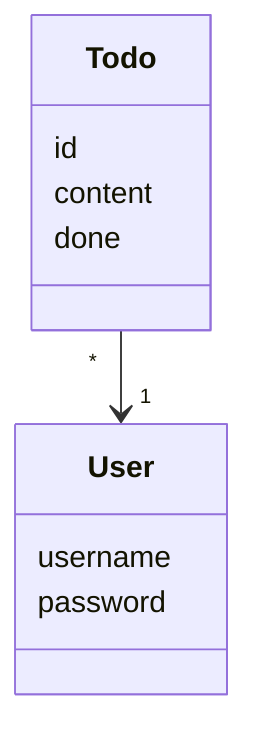
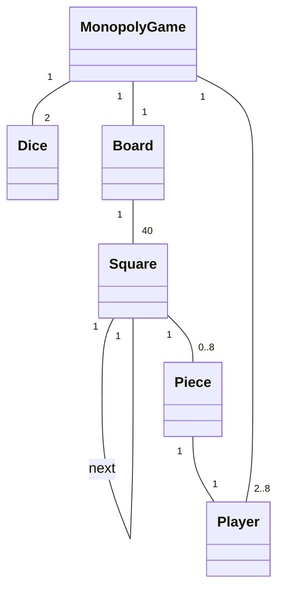



This week, you will get 1 points for returning the tasks and 2 points for returning the practical work.

Make a new folder named `week3` under the `exercises` folder in your repository to submit this week's exercises.

## UML

We often use Universal Markup Language ([UML](https://en.wikipedia.org/wiki/Unified_Modeling_Language)) to draw the structure of our program. There are many different graph types available; today, we will get to know just three of them.

### Class diagrams

If you have done the Introduction to Databases course, you may have seen how to use class diagrams.
The point of class diagrams is to show the relationship between different classes in your program.

Suppose we have a Todo app that we want to draw a diagram for.
The app has a class for its users:

```python
class User:
    def __init__(self, username, password):
        self.username = username
        self.password = password
```

and a class for its Todo items:

```python
import uuid

class Todo:
    def __init__(self, content, done=False, user=None, todo_id=None):
        self.content = content
        self.done = done
        self.user = user
        self.id = todo_id or str(uuid.uuid4())

    def set_done(self):
        self.done = True
```

If you're wondering what the `import uuid` does, it lets you make random ID values, which the class uses to identify todo list tasks (instead of making the IDs 1, 2, 3, 4, ...)

In this app, each todo has exactly one user attached, and each user can have multiple todo tasks. This is represented by the following diagram:


All of this information is a lot. Usually, we are only interested in the classes and their links between them, and we can simplify the diagram as follows:


You can see more details by reading the code (or "docstrings", which we will get back to in week 6).

#### Dependency

The lines in UML-diagrams are _fixed relationships_ between classes.
Sometimes it is useful to also notate _temporary relationships_, or _dependencies_ between classes.

We saw an example of fixed relationships above. An example of a temporary relationship is the following.

Below is the PaymentCard class from last week:

```python
class PaymentCard:
    def __init__(self, balance):
        # balance is in cents
        self.balance = balance

    def add_money(self, amount):
        self.balance += amount

    def take_money(self, amount):
        if self.balance < amount:
            return False

        self.balance = self.balance - amount
        return True
```

As you can see, there is no mention of the cash register anywhere.
The (redacted) code for the cash register is here:

```python
CHEAP_PRICE = 2.5
YUMMY_PRICE = 4.3

class CashRegister:
    def __init__(self):
        self.cheap = 0
        self.yummy = 0

    def eat_cheap(self, card):
        if card.balance() < CHEAP_PRICE:
            return False
        
        card.take_money(CHEAP_PRICE)
        self.cheap += 1
        return True

    def eat_yummy(self, card):
        # ...

    def add_money_to_card(self, card, amount):
        if amount < 0:
            return
        
        card.add_money(amount)
        self.money += amount
```

The payment terminal class uses card (Kortti) objects temporarily when its eat food cheap/expensive and add money functions are called.
However, it has no permanent memory of any payment cards.
We draw such relationships as dashed lines instead of the solid lines in the previous part. 

An example of a possible diagram is below. Note the dashed arrow, and the fact that we don't label this arrow with a number (unlike the previous case.)


One final example. Here we have a class responsible for the program logic of our Todo app.

```python
class TodoService:
    def __init__(self, todo_repository, user_repository):
        self._user = None
        self._todo_repository = todo_repository
        self._user_repository = user_repository

    def create_todo(self, content):
        todo = Todo(content=content, user=self._user)

        return self._todo_repository.create(todo)

    def get_undone_todos(self):
        if not self._user:
            return []

        todos = self._todo_repository.find_by_username(self._user.username)
        undone_todos = filter(lambda todo: not todo.done, todos)

        return list(undone_todos)

    # ...
```

The program logic knows and remembers the logged in user, but can only access the user's todo list items only through the `todo_repository` object. This is why there is no fixed link, but only a dependency between the program logic and the `Todo` class.


Marking down dependencies is not usually necessary; only do it if they tell you something insightful about the program logic.

#### Inheritance

Classes can [inherit](https://docs.python.org/3/tutorial/classes.html#inheritance) other classes (check the Advanced Course in Programming material!). To notate this in UML, we use arrows with white heads.
For example, if there was another class, `SuperUser`, that inherited the `User` class, it would be marked as follows:


#### Tools to draw diagrams

When using Markdown on GitHub, you can draw these diagrams directly by typing out little bits of text instead of drawing pictures and saving them (!) To do this, we use something called [Mermaid](https://mermaid-js.github.io/mermaid/).

Here's an example of how you would type this in Markdown:

````markdown
## Program logic

The program relies on the User and Todo classes,
which are related in the following way:


````

Note the three backticks (` symbols) that are used to tell Markdown that you have Mermaid code. You can also use these backticks to e.g. show Python code in your Markdown files. The code will not be run but will appear nicely formatted in your text.

When rendered, the diagram looks like this:


Of course, you're allowed to use any program you like for drawing diagrams (Paint, PowerPoint, etc.) but Mermaid is the recommended way.

---

### Task 1: Monopoly

Let's take a toy example: the game Monopoly. We will make a class diagram representing the relationship between the different things in the game.

First step: basics. Our game has at least 2 and at most 8 players. There are 2 dice. There is 1 game board. The board has 40 squares. Each square knows what the next square is. Each player has one piece that they play with. Each piece is in exactly one square.



The above diagram is made with the following code:

````markdown

````

Your task is to extend this diagram.
Make the following amendments:

- There are multiple different types of squares
  - Starting square
  - Jail
  - Chance and Community Chest
  - Train stations
  - Utilities
  - Normal streets that have a name
- The MonopolyGame class needs to know where the starting square and the jail square are
- Each square has some sort of functionality (which can be just some function, pick any name)
- Chance and Community Chest squares each have some cards, which have some functionality (again, just some function)
- There are different types of functionalities. No need to specify what kind.
- The players have money
- The streets can have at most 4 buildings or one hotel
- The streets can be owned by some player

**If you don't know how to use Mermaid**, you can check the syntax from [their webpage](https://mermaid-js.github.io/mermaid/).

**Create a folder called `week3` under the `exercises` folder and add your diagram there**.
If you use Mermaid to make your diagram, you can just add a Markdown file with your Mermaid code inside.

### Package diagram

The code of the Todo app is laid out as follows in different files and folders. Note: in this section we call folders _packages_.


We can visualise this by using a _package diagram_ in Mermaid.


_Dependencies_ between the packages (folders) are denoted by a dashed line.

The `ui` package depends on the `services` package, since the classes in the files inside the `ui` folder depend on the classes in the files in the `services` folder. More specifically, they depend on the `TodoService` class, which is in the `todo_service.py` file in the `services` folder.

Similarly, the `services` package depends on the `repositories` package, since the `TodoService` class (somewhere in the `services` folder) uses the `TodoRepository` and `UserRepository` classes (somewhere in the `repositories` folder).

Instead of writing this out in words, we could also have displayed this information as a diagram, showing what classes can be found in which folders:


Remember, if you need a recap on how these sorts of programs (with classes doing certain things) work, check out [part 10 of the Advanced Programming course, under "Developing a larger application"](https://programming-23.mooc.fi/part-10/4-application-development). To see how to apply this to your own project, check out [the implementation guidelines](/en/tasks/implementation).

### Sequence diagrams

The previous two types of diagrams, class and package diagrams, describe the program's structure. However, the functionality of the application is not encoded in any way.
_Sequence diagrams_ aim to describe how classes call each others' functions.

Let's go back to the payment card and payment terminal example.
Paying by card works as follows: the payment terminal checks whether the balance on the card is enough, and if it is, it then takes money off the card by calling the `take_money` method.

```python
CHEAP_PRICE = 2.5

class CashRegister:
    # ...

    def eat_cheap(self, card):
        if card.balance() < CHEAP_PRICE:
            return False
        
        card.take_money(CHEAP_PRICE)
        self.cheap += 1
        return True
    
    # ...
```

This can be represented by a class diagram (not yet a sequence diagram!) as follows:


Now, this doesn't describe the functionality at all. 
The above interaction can be represented by a sequence diagram like this:


On sequence diagrams, time goes from top to bottom.
Function calls are represented by horizontal arrows going from whoevers calling a function, to the class whose function is being called.
A return value is represented by a dashed line.
Reading a parameter is represented in the same way as a function call.

Let's see another example. In this case, the sequence diagram shows what happens if the card doesn't have enough money on it.


#### More complex example

Have a look at this more complex example.
Note that, although it's in Finnish, you _don't_ need to understand what the Finnish words mean.
You can imagine that they're complete gibberish.
Just imagine you are the computer reading the code, and stepping through it one line at a time, going into functions whenever you come across them.

Try to compare the code (stepping through it one line at a time) to the sequence diagram, and see if it makes any sense that way.

Code:

```python
class Henkilo:
    def __init__(self, nimi, palkka, tilinumero):
        self.nimi = nimi
        self.palkka = palkka
        self.tilinumero = tilinumero

class Henkilostorekisteri:
    def __init__(self):
        self._henkilot = {}
        self._pankki = PankkiRajapinta()

    def lisaa(self, henkilo):
        self._henkilot[henkilo.nimi] = henkilo

    def suorita_palkanmaksu(self):
        for nimi in self._henkilot:
            henkilo = self._henkilot[nimi]
            self._pankki.maksa_palkka(henkilo.tilinumero, henkilo.palkka)

    def aseta_palkka(self, nimi, uusi_palkka):
        henkilo = self._henkilot[nimi]
        henkilo.palkka = uusi_palkka

class PankkiRajapinta:
    # ...

    def maksa_palkka(tilinumero, summa):
        # suorittaa maksun verkkopankin internet-rajapinnan avulla
        # yksityiskohdat piilotettu
```

Main function:

```python
def main():
    rekisteri = Henkilostorekisteri()

    arto = Henkilo("Hellas", 1200, "1234-12345")
    rekisteri.lisaa(arto)

    sasu = Henkilo("Tarkoma", 6500, "4455-123123")
    rekisteri.lisaa(sasu)

    rekisteri.aseta_palkka("Hellas", 3500)

    rekisteri.suorita_palkanmaksu()
```


Sequence diagram:


Try to spend at least 5-10 minutes figuring out what this sequence diagram is saying. This is a rather complex example, and fully understanding what is going on (especially if you do not speak Finnish) is not required. We will practice drawing our own sequence diagrams soon.

#### Tools for drawing sequence diagrams

You can use Mermaid again!
For this, check the instructions on their website: [Sequence diagram](https://mermaid-js.github.io/mermaid/#/sequenceDiagram).

You can also check the example project's sequence diagram here: [architecture](https://raw.githubusercontent.com/ohjelmistotekniikka-hy/python-todo-app/master/dokumentaatio/arkkitehtuuri.md)

---

### Task 2: sequence diagram

Let's take another short program, that simulates how HSL cards work.

Your task is to describe how the `main` function works as a sequence diagram.

Your sequence diagram must include (similar to the above example):
- All object creation
- All function calls
- All variable reads (if they happen across different classes)

Code:

```python
class Kiosk:
    def buy_travel_card(self, name, amount = None):
        new_card = TravelCard(name)

        if amount:
            new_card.increase_balance(amount)

        return new_card

class TravelCard:
    def __init__(self, owner):
        self.owner = owner
        self.day = 0
        self.month = 0
        self.amount = 0

    def increase_balance(self, amount):
        self.amount += amount

    def reduce_balance(self, amount):
        self.amount -= amount

    def new_time(self, day, month):
        self.day = day
        self.month = month

class TicketBooth:
    def add_balance(self, card, amount):
        card.increase_balance(amount)

    def add_time(self, card, day, month):
        card.new_time(day, month)

TRAM = 1.5
HELSINKI = 2.1
CAPITAL_REGION = 3.5

class Reader:
    def buy_ticket(self, card, ticket_type):
        price = 0

        if ticket_type == 0:
            price = TRAM
        elif ticket_type == 1:
            price = HELSINKI
        else:
            price = CAPITAL_REGION

        if card.amount < price:
            return False

        card.reduce_balance(price)

        return True

class HSLCardReaderManagement:
    def __init__(self):
        self._ticketbooths = []
        self._readers = []

    def add_ticketbooth(self, ticketbooth):
        self._ticketbooths.append(ticketbooth)

    def add_reader(self, reader):
        self._readers.append(reader)

def main():
    management = HSLCardReaderManagement()

    rautatietori = TicketBooth()
    tram6 = Reader()
    bus244 = Reader()

    management.add_ticketbooth(rautatietori)
    management.add_reader(tram6)
    management.add_reader(bus244)

    kiosk1 = Kiosk()
    kalles_card = kiosk1.buy_travel_card("Kalle")

    rautatietori.add_balance(kalles_card, 3)

    tram6.buy_ticket(kalles_card, 0)
    bus244.buy_ticket(kalles_card, 2)

if __name__ == "__main__":
    main()
```

**Add your diagram to the `laskarit/viikko3` folder**.
If you use Mermaid to make your diagram, you can just put the Markdown file with the Mermaid code in your folder.

## Invoke and making tasks

Imagine you have the following situation: you've written your app and you run it. While it's running, it creates lots of different files and saves stuff and makes a mess. You then want to run it again from a clean slate.
This is very annoying and tedious to do by hand. Thankfully, we can create a _task_ that will do everything for us. An example of a task can be: delete all unnecessary files and start your program's main file by running the command `python3 src/index.py`. 

To make tasks, we will use a tool called [Invoke](http://docs.pyinvoke.org/en/stable/).

### Installation

In your project folder, run

```bash
poetry add invoke
```

### Making tasks

Tasks are added to the root of your project into a file called `tasks.py`. Here, as a toy example, we create a task `foo` that just prints the word `bar`. Note that the `@task` text before the function is called a decorator and tells Invoke that the function we've written is a task.

```python
from invoke import task

@task
def foo(ctx):
    print("bar")
```

We can run this by typing the following in a terminal:

```bash
poetry run invoke foo
```

For an actual useful example, let's make a task that starts our program:

```python
from invoke import task

@task
def foo(ctx):
    print("bar")

@task
def start(ctx):
    ctx.run("python3 src/index.py", pty=True)
```

You can test this by running `poetry run invoke start`. Note that, in the above code, you need to include `pty=True` for everything to work.

You can list all the available tasks by running

```bash
poetry run invoke --list
```

### Naming tasks

Don't use camelCase to name your tasks.
Instead, use [snake_case](https://en.wikipedia.org/wiki/Snake_case).
Note that in this case, when running the command in the terminal, the command will be in [kebab-case](https://en.wikipedia.org/wiki/Letter_case#Kebab_case).

Example:

```python
from invoke import task

@task
def lorem_ipsum(ctx):
    print("Lorem ipsum")
```

You run this using `poetry run invoke lorem-ipsum`.

### Dependent tasks

Another use case of tasks: making coverage reports.
Last week, we used two commands, `coverage run --branch -m pytest` and `coverage html` (in that order) to first test the program and then generate the coverage report.

We could create two new tasks like this:

```python
from invoke import task

@task
def coverage(ctx):
    ctx.run("coverage run --branch -m pytest", pty=True)

@task()
def coverage_report(ctx):
    ctx.run("coverage html", pty=True)
```

And then run the tasks in order like this:

```bash
poetry run invoke coverage coverage-report
```

If you run the tasks in the wrong order, you'll either get old results or an error. To avoid doing this by accident, let's tell Invoke that the `coverage_report` function is dependent on the `coverage` function:

```python
from invoke import task

@task
def coverage(ctx):
    ctx.run("coverage run --branch -m pytest", pty=True)

@task(coverage)
def coverage_report(ctx):
    ctx.run("coverage html", pty=True)
```

Now, running `poetry run invoke coverage-report` will automatically first run the `coverage` task and you don't have to worry about running both in a specific order.

---

## Practical work

This week, you will begin implementing your program and testing it.
Your project should progress more-or-less evenly throughout all the weeks of the course. That is, if you get all of your work done before the end of the course, then you will still need to do a comparable amount of work each week (by extending your program, etc.) to get progression points.

**This week, you will get 2 points for returning the practical work**.
You may check the [grading requirements](/en/tasks/criteria) to see what's expected of you.

### Warning: pip

If you install packages, don't do it through pip. Use Poetry to install all packages.

### Practical work 1: Initialising your project and using Poetry

Use last week's Poetry instructions to initialise your project.
Your main repository's folder structure should looks something like this:

```
exercises/
  ...
documentation/
  ...
src/
  ...
pyproject.toml
poetry.lock
README.md
...
```

The `exercises` folder contains all your weekly exercises; nothing related to the practical work.
`documentatoin` should contain the documentation you will be writing (and have already started writing).
Finally, the `src` folder will contain all your source code for the practical work.

**Note:** under _every folder_ that's inside the `src` folder (and in the folders inside those, and in the folders inside those...) you should create an empty file with the name `__init__.py`. This will ensure that all imports work as intended. Do not put an `__init__.py` file in the `src` folder itself.

### Practical work 2: Functionality

Make some functionality for your program, based on your last week's spec document.

The functionality should be put into classes (except if it's stuff related to graphics or a user interface).

Just empty classes or functions won't give you points. As an example, if you said last week that your program will calculate something, implement (part of, or all of) the calculation in a class.

Some more instructions on implementing can be found [here](/en/tasks/implementation). If you are making a game, check out the [pygame instructions](/en/tasks/pygame).

### Practical work 3: Preliminary test implementation

Your app should have _at least one test_.
The test should test something that's relevant to the functionality of your program. It must also pass.

Make a new folder for your tests under `src`:

```
src/
  tests/
    __init__.py
    ...
  ...
```

Review last week's `unittest` instructions and make a test for one of the classes you implemented in the previous part.

### Practical work 4: Test coverage report

In the same folder as your `pyproject.toml` file (i.e. in the root of your repository) there should be a `.coveragerc` file (create it if not).

Paste the following code into there:

```
[run]
source = src
omit = src/**/__init__.py,src/tests/**
```

Review last week's material to make a coverage report for your implemented features.

### Practical work 5: Invoke tasks

Make the following invoke tasks (using the previous section's instructions):

- `poetry run invoke start` runs your program
- `poetry run invoke test` runs your tests using pytest
- `poetry run invoke coverage-report` collects the test coverage data and generates an HTML file that contains the coverage report (same as the example in the previous section).

The reference project should have an example on this.
You can also add other tasks if you find that they save you some time or some hassle.

### Practical work 6: Changelog

One common way of tracking your progress is using a changelog.

In the `documentation` folder, make a `changelog.md` file and add the changes that you make to your project **every week**. Examples of significant changes that you should include:
- Changes to the user interface
- New features
- Architectural changes (new classes, functions)
- New tests

An example of a changelog for this week:

````markdown
## Week 3

- The user can now see a list of all todos
- Added a `TodoRepository` class, which is responsible for saving the todos into a CSV file
- Added a `TodoService` class, which handles the program logic
- Added tests to verify that the `TodoRepository` class returns all the todos
````

Add a link to the `README.md` file that leads to the `changelog.md` file.

### Practical work 7: Other stuff

Make sure that the following things are in order:

- Time tracking sheet is up-to-date
  - Do not include the time spent on the weekly exercises
- You've updated the `changelog.md` file
- Your `README.md` file is clean and professional
  - The file should contain only information that's relevant to your project
  - The title should be your project name
  - There should be a short description of your project
  - All the links to your documentation should be in a neat list under the title `Documentation`
  - All other links (e.g. links to the `exercises` folder and its files) should be deleted
  - See the [example](https://github.com/ohjelmistotekniikka-hy/python-todo-app/blob/master/README.md) for details
- The repository is clean
  - You should not have any `pytest` or `coverage` related files in your repository
  - If there are, remove them by running `git rm`
  - Make sure that these files are then ignored using a `.gitignore` file
  - Also, include any other trash files you may have in your `.gitignore`
  - Any files related to the weekly exercises should be under `exercises`




